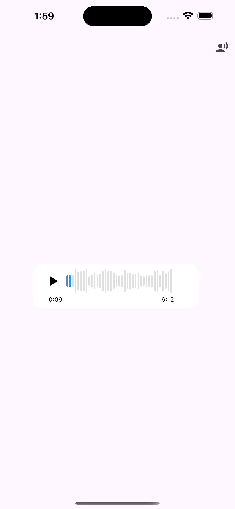
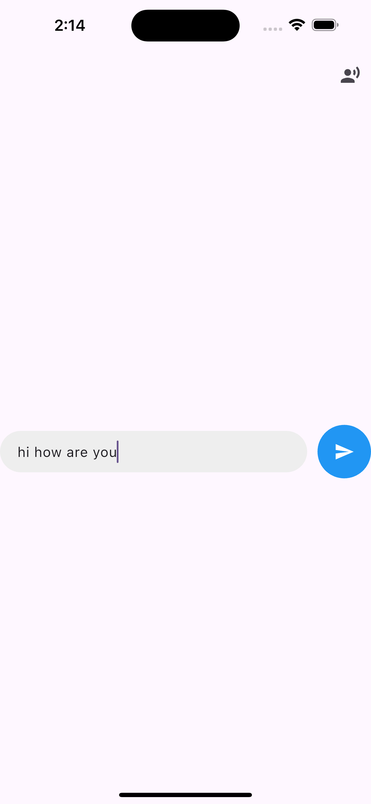
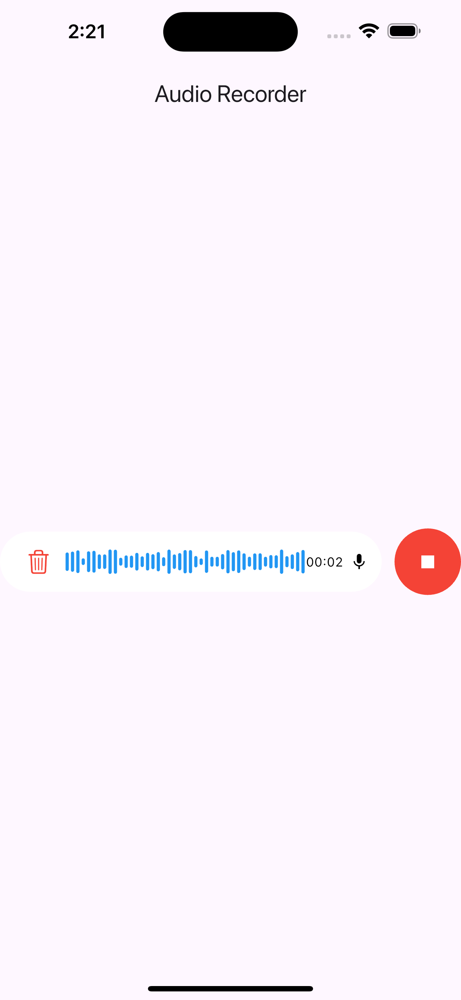
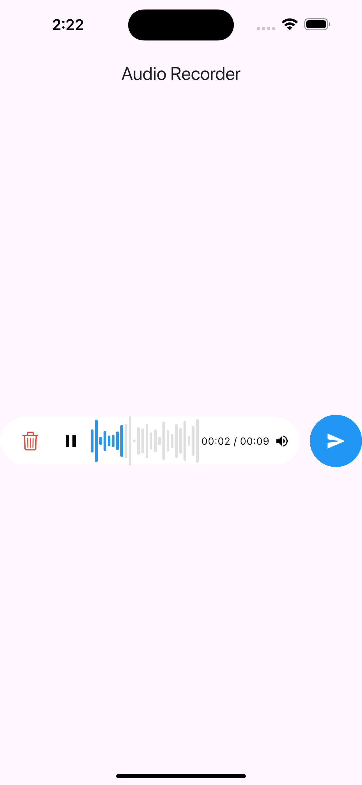

🎧 audio_play_or_record

A Flutter package for recording and playing audio messages with interactive waveform visualization, seek support, and chat-style UI inspired by WhatsApp.

✨ Features

* 🎙 Audio Recording – Supports tap or long-press to record.

* ▶️ Audio Playback with Waveform – Visualize your recordings with interactive waveforms.

* ⏱ Seekable Waveform – Tap or drag the waveform to jump to any position.

* 🎚 Animated Waveform – Real-time animation while recording audio.

* 🧩 Fully Customizable UI – Customize colors, icons, layouts, and styles to fit your app.

📸 Screenshots


## 📸 Screenshots

<table align="center">
  <tr>
    <td align="center" width="50%">
      <br/><br/>
      <b>Audio</b>
    </td>
    <td align="center" width="50%">
      <br/><br/>
      <b>Input Field</b>
    </td>
  </tr>
  <tr>
    <td align="center" width="50%">
      <br/><br/>
      <b>Audio Recording</b>
    </td>
    <td align="center" width="50%">
      <br/><br/>
      <b>Voice Preview</b>
    </td>
  </tr>
</table>


📦 Installation

Add this to your pubspec.yaml:

`dependencies:
audio_play_or_record: ^1.0.0`


Then run:

`flutter pub get`

🔐 Permissions
✅ Android

📍 android/app/src/main/AndroidManifest.xml
```
<uses-permission android:name="android.permission.RECORD_AUDIO"/>
<uses-permission android:name="android.permission.INTERNET"/>
```
🍎 iOS

📍 ios/Runner/Info.plist
```
<key>NSMicrophoneUsageDescription</key>
    <string>This app needs microphone access to record audio.</string>

<key>NSAppTransportSecurity</key>
    <dict>
        <key>NSAllowsArbitraryLoads</key>
        <true/>
    </dict>
```

🎯 Runtime Permission (Android)

Request microphone permission in the host app:
```
import 'package:permission_handler/permission_handler.dart';

await Permission.microphone.request();
```

ℹ️ permission_handler is required only in the host app, not inside this package.


🧱 Basic Usage

🔊 Audio Message Player
```
import 'package:flutter/material.dart';
import 'package:audio_play_or_record/audio_play_or_record.dart';

void main() {
  runApp(const MyApp());
}

class MyApp extends StatelessWidget {
  const MyApp({super.key});

  @override
  Widget build(BuildContext context) {
    return MaterialApp(
      title: 'Audio Playback',
      debugShowCheckedModeBanner: false,
      theme: ThemeData(
        colorScheme: .fromSeed(seedColor: Colors.deepPurple),
      ),
      home: Scaffold(
        appBar: AppBar(
          actions: [
            IconButton(onPressed: (){
              Navigator.push(context,
                  MaterialPageRoute(builder: (context)=>HomeS())
              );
            }, icon: Icon(Icons.record_voice_over))
          ],
        ),
        body: Center(
          child: SizedBox(
            width: MediaQuery.of(context).size.width-120,
            child: AudioMessage(
              waveWidth: MediaQuery.of(context).size.width-120,
              isSender: true,
              isProfile: false,
              audioPath: 'https://www.soundhelix.com/examples/mp3/SoundHelix-Song-1.mp3',
              config: AudioMessageConfig(
                  showDuration: false
              ),
            ),
          ),
        ),
      ),
    );
  }
}
```

🎤 Record Mic Button
```
import 'package:flutter/material.dart';
import 'package:permission_handler/permission_handler.dart';
import 'package:audio_play_or_record/audio_play_or_record.dart';

void main() {
  runApp(const MyApp());
}

class MyApp extends StatelessWidget {
  const MyApp({super.key});

  @override
  Widget build(BuildContext context) {
    return const MaterialApp(
      debugShowCheckedModeBanner: false,
      home: HomePage(),
    );
  }
}

class HomePage extends StatefulWidget {
  const HomePage({super.key});

  @override
  State<HomePage> createState() => _HomePageState();
}

class _HomePageState extends State<HomePage> {
  bool _micGranted = false;
  String? audio;

  @override
  void initState() {
    super.initState();
    _requestMicPermission();
  }

  Future<void> _requestMicPermission() async {
    final status = await Permission.microphone.request();
    setState(() => _micGranted = status.isGranted);
  }

  @override
  Widget build(BuildContext context) {
    return Scaffold(
      appBar: AppBar(title: const Text('Audio Recorder')),
      body: Center(
        child: RecordMicButton(
          hasMicPermission: _micGranted,
          audioPath: audio,
          isSendEnable: audio != null,
          onRecorded: (path) => setState(() => audio = path),
          onDelete: () => setState(() => audio = null),
          onMessageSend: () {
            debugPrint('Message sent');
          },
          config: const RecordButtonConfig(
            enableLock: true,
            enableHaptics: true,
          ),
        ),
      ),
    );
  }
}
```

🎨 Customization

* You can fully tailor the package to match your app’s style and behavior:

* Waveform Colors – Customize the colors of recording and playback waveforms.

* Icons – Use your own icons for mic, play, pause, and delete actions.

* Button Size & Padding – Modify the size and padding of recording/playback buttons.

* Recording Behavior – Choose between tap, long-press, or lock-to-record modes.


📱 Supported Platforms

* ✅ Android – Fully tested on devices and emulators.

* ✅ iOS – Works on real devices (requires microphone permission).

🧰 Dependencies & Usage Notes

* `dart:io` – Handles audio files and file system operations.

* `flutter/material` – Provides UI widgets such as buttons, icons, and layouts.

* `path_provider` – Accesses device directories to save recorded audio files.

* `permission_handler` – Not included in the package. The host app must request microphone permission at runtime if needed.

📄 License
```
MIT License

Copyright (c) 2025 Bala Sivanantham <mbalasivanantham@gmail.com>

Permission is hereby granted, free of charge, to any person obtaining a copy
...
